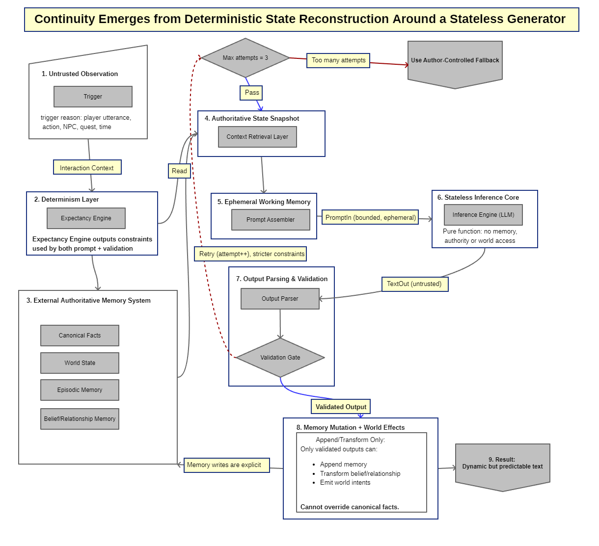

# LlamaBrain Architecture

**"Continuity Emerges from Deterministic State Reconstruction Around a Stateless Generator"**

This document provides a comprehensive explanation of the LlamaBrain architectural pattern, which ensures deterministic, controlled AI behavior while maintaining the flexibility and creativity of Large Language Models.



## Overview

LlamaBrain solves a fundamental problem in AI-powered applications: **how to maintain deterministic, authoritative game state when using stochastic LLMs**. The architecture treats the LLM as a pure, stateless generator while maintaining continuity through deterministic state reconstruction.

**Core Principle**: The LLM has no memory, no authority, and no direct access to world state. All context is provided through bounded prompts, and all outputs are validated before any state changes occur.

## The Nine-Component Architecture

The system consists of nine interconnected components that work together to ensure deterministic state management:

### Component 1: Untrusted Observation → Interaction Context

**Purpose**: Capture and structure the trigger that initiates an AI interaction.

**Implementation**:
- `InteractionContext` class in `LlamaBrain.Core.Expectancy`
- Unity wrapper: `UnityStateSnapshotBuilder.BuildForNpcDialogue()`, `BuildForZoneTrigger()`

**Trigger Reasons**:
- `PlayerUtterance` - Player speaks to NPC
- `ZoneTrigger` - NPC enters a trigger zone
- `TimeTrigger` - Time-based event
- `QuestTrigger` - Quest state change
- `NpcInteraction` - NPC-to-NPC interaction
- `WorldEvent` - Game world event
- `Custom` - Custom trigger type

**Example**:
```csharp
var context = new InteractionContext
{
    TriggerReason = TriggerReason.PlayerUtterance,
    NpcId = "wizard_001",
    SceneName = "TowerRuins",
    PlayerInput = "Tell me about the ancient tower",
    GameTime = Time.time,
    Tags = new List<string> { "quest_related", "lore" }
};
```

### Component 2: Determinism Layer (Expectancy Engine)

**Purpose**: Generate constraints based on interaction context that control both prompt assembly and output validation.

**Implementation**:
- `ExpectancyEvaluator` in `LlamaBrain.Core.Expectancy` (engine-agnostic)
- `ExpectancyEngine` in `LlamaBrainRuntime` (Unity MonoBehaviour wrapper)
- `ExpectancyRuleAsset` (ScriptableObject for designer-created rules)
- `NpcExpectancyConfig` (NPC-specific rule configuration)

**Constraint Types**:
- **Permission**: Allows specific behaviors (Soft, Hard, Critical severity)
- **Prohibition**: Prevents specific behaviors (Soft, Hard, Critical severity)
- **Requirement**: Requires specific behaviors (Soft, Hard, Critical severity)

**How It Works**:
1. Rules are evaluated based on `InteractionContext` (trigger reason, NPC ID, scene, tags)
2. Matching rules generate constraints
3. Constraints are injected into prompts via `ConstraintSet.ToPromptInjection()`
4. Same constraints are used by `ResponseValidator` to validate outputs

**Example**:
```csharp
// Create a rule: "Guard cannot reveal secrets"
var rule = ExpectancyRuleAsset.Create();
rule.RuleType = ExpectancyRuleType.Prohibition;
rule.Severity = ConstraintSeverity.Hard;
rule.AddCondition(new TriggerReasonCondition(TriggerReason.PlayerUtterance));
rule.Description = "Cannot reveal classified information";
rule.PromptInjection = "You must NOT reveal any classified information.";

// Evaluate rules
var constraints = expectancyEvaluator.EvaluateRules(context, rules);
// constraints now contains prohibitions that will be checked during validation
```

**Integration**:
- `LlamaBrainAgent` automatically evaluates rules if `NpcExpectancyConfig` is attached
- Constraints are tracked in `LastConstraints` property for debugging
- `SendPlayerInputWithContextAsync()` allows passing custom context and trigger-specific rules

### Component 3: External Authoritative Memory System

**Purpose**: Maintain authoritative, structured memory that LLMs cannot corrupt.

**Implementation**:
- `AuthoritativeMemorySystem` in `LlamaBrain.Persona`
- `PersonaMemoryStore` provides convenience API
- Four distinct memory types with authority hierarchy

**Memory Types** (in authority order):

1. **Canonical Facts** (Highest Authority)
   - Immutable world truths
   - Cannot be modified or overridden
   - Only `MutationSource.Designer` can create
   - Example: "The king is named Arthur", "Magic exists in this world"

2. **World State** (High Authority)
   - Mutable game state
   - Can be updated by game systems (`MutationSource.GameSystem`)
   - Example: "CurrentWeather: Stormy", "door_castle_main: open"

3. **Episodic Memory** (Medium Authority)
   - Conversation history and events
   - Automatic decay based on significance
   - Can be appended by validated outputs
   - Example: "Player said hello", "NPC witnessed a battle"

4. **Belief Memory** (Lowest Authority)
   - NPC opinions and relationships
   - Can be wrong, can be contradicted
   - Confidence-based filtering
   - Example: "NPC thinks player is trustworthy", "NPC dislikes merchant"

**Authority Enforcement**:
- Canonical facts cannot be modified by any source
- World state requires `GameSystem` authority
- Episodic memory and beliefs can be modified by validated outputs
- Attempts to override canonical facts are blocked and logged

**Example**:
```csharp
var memorySystem = memoryStore.GetOrCreateSystem("wizard_001");

// Add canonical fact (immutable)
memorySystem.AddCanonicalFact("king_name", "The king is named Arthur", "world_lore");

// Set world state (mutable)
memorySystem.SetWorldState("CurrentWeather", "Stormy", MutationSource.GameSystem);

// Add episodic memory (with significance)
var entry = new EpisodicMemoryEntry("Player saved the village", EpisodeType.MajorEvent);
memorySystem.AddEpisodicMemory(entry, MutationSource.ValidatedOutput);

// Set belief (can be wrong)
var belief = BeliefMemoryEntry.CreateOpinion("player", "is a hero", sentiment: 0.9f, confidence: 0.95f);
memorySystem.SetBelief("hero_opinion", belief, MutationSource.ValidatedOutput);
```

### Component 4: Authoritative State Snapshot

**Purpose**: Create an immutable snapshot of all context at inference time for deterministic retries.

**Implementation**:
- `StateSnapshot` in `LlamaBrain.Core.Inference` (engine-agnostic)
- `StateSnapshotBuilder` with fluent API
- `ContextRetrievalLayer` for intelligent memory retrieval
- `UnityStateSnapshotBuilder` for Unity-specific integration

**Components of a Snapshot**:
- Interaction context (trigger, NPC ID, scene, player input)
- Retrieved memories (canonical facts, world state, episodic, beliefs)
- Constraints from expectancy engine
- Dialogue history
- System prompt and metadata
- Attempt number and max attempts

**Context Retrieval**:
- `ContextRetrievalLayer` retrieves relevant memories using:
  - **Recency**: More recent memories prioritized
  - **Relevance**: Keyword matching against player input
  - **Significance**: Higher significance memories retained longer
  - **Confidence**: Beliefs filtered by confidence threshold
- Configurable limits prevent token bloat

**Retry Support**:
- `StateSnapshot.ForRetry()` creates new snapshot with merged constraints
- Attempt number tracked for retry limits
- Snapshot is immutable - can be replayed exactly

**Example**:
```csharp
// Retrieve relevant context
var retrievalLayer = new ContextRetrievalLayer(memorySystem);
var retrievedContext = retrievalLayer.RetrieveContext(playerInput);

// Build snapshot
var snapshot = new StateSnapshotBuilder()
    .WithContext(interactionContext)
    .WithConstraints(constraints)
    .WithSystemPrompt(profile.SystemPrompt)
    .WithPlayerInput(playerInput)
    .Apply(retrievedContext) // Apply retrieved memories
    .WithAttemptNumber(0)
    .WithMaxAttempts(3)
    .Build();

// For retry, create new snapshot with stricter constraints
var retrySnapshot = snapshot.ForRetry(escalatedConstraints, attemptNumber: 1);
```

### Component 5: Ephemeral Working Memory

**Purpose**: Create a bounded, token-efficient prompt from the snapshot that exists only for the current inference.

**Implementation**:
- `EphemeralWorkingMemory` in `LlamaBrain.Core.Inference`
- `PromptAssembler` for prompt construction
- `WorkingMemoryConfig` for configurable bounds
- `PromptAssemblerSettings` (Unity ScriptableObject)

**Bounding Strategy**:
- Explicit limits on exchanges, memories, beliefs, characters
- Character-based truncation with priority:
  1. Canonical facts (always included)
  2. World state (always included)
  3. Recent episodic memories (by significance)
  4. High-confidence beliefs
- Preset configurations: Default, Minimal, Expanded

**Working Memory Lifecycle**:
1. Created from `StateSnapshot` by `PromptAssembler`
2. Bounded according to `WorkingMemoryConfig`
3. Used to assemble prompt
4. Discarded after inference (implements `IDisposable`)

**Example**:
```csharp
// Create working memory config
var config = WorkingMemoryConfig.Default;
config.MaxExchanges = 5; // Last 5 dialogue exchanges
config.MaxMemories = 10; // Top 10 episodic memories
config.MaxBeliefs = 5; // Top 5 beliefs
config.MaxCharacters = 2000; // 2000 character limit

// Assemble prompt
var assembler = new PromptAssembler(PromptAssemblerConfig.Default);
var assembledPrompt = assembler.AssembleFromSnapshot(snapshot);

// assembledPrompt.PromptText contains bounded, token-efficient prompt
// assembledPrompt.WorkingMemory will be disposed after use
```

**Few-Shot Prompt Priming** (In-Context Learning):
- **Purpose**: Provide example demonstrations to guide LLM output format, tone, and behavior
- **Integration**: Few-shot examples are captured via `InteractionContext.TriggerPrompt` or dedicated few-shot fields in `StateSnapshot`
- **Variants**:
  - **Few-Shot**: Multiple input-output demonstration examples showing desired behavior
  - **Exemplar Prompting**: Representative examples with emphasis on specific patterns
  - **Prompt Priming**: Style/tone samples to bias output format without full examples
- **Deterministic Ordering**: Examples are ordered deterministically (by sequence number, timestamp, or explicit ordering) to ensure byte-stable prompt assembly
- **Placement**: Configurable placement in prompt (before system prompt, after system prompt, before player input, etc.)
- **Configuration**: `PromptAssemblerConfig` includes formatting options for few-shot sections

**Example**:
```csharp
// Set few-shot examples in interaction context
var context = new InteractionContext
{
    TriggerReason = TriggerReason.PlayerUtterance,
    NpcId = "wizard_001",
    PlayerInput = "Tell me about magic",
    TriggerPrompt = @"Example 1:
Player: What is magic?
Wizard: Magic is the art of channeling the world's energy through focused will.

Example 2:
Player: How do I learn magic?
Wizard: Magic requires years of study and a deep understanding of the arcane principles."
};

// Few-shot examples are automatically included in prompt assembly
// PromptAssembler injects them according to configuration
var snapshot = new StateSnapshotBuilder()
    .WithContext(context)
    .Build();
    
var assembledPrompt = assembler.AssembleFromSnapshot(snapshot);
// assembledPrompt.PromptText now includes few-shot examples in the configured location
```

### Component 6: Stateless Inference Core

**Purpose**: Pure stateless text generation - the LLM has no memory, authority, or world access.

**Implementation**:
- `ApiClient` in `LlamaBrain.Core` (HTTP client for llama.cpp)
- `BrainServer` in `LlamaBrainRuntime` (Unity server management)
- No state stored in LLM
- No direct memory access
- No authority to modify state

**Key Properties**:
- **Pure Function**: Same input = same output (when constraints are met)
- **No Memory**: LLM receives only the bounded prompt
- **No Authority**: LLM cannot directly modify any state
- **Bounded Input**: Receives only ephemeral working memory

**Example**:
```csharp
// LLM receives only the bounded prompt
var response = await apiClient.SendPromptAsync(assembledPrompt.PromptText);

// Response is untrusted - must be validated before use
// LLM has no knowledge of what happened before or after
```

### Component 7: Output Parsing & Validation

**Purpose**: Parse LLM output and validate it against constraints and canonical facts before any state changes.

**Implementation**:
- `OutputParser` in `LlamaBrain.Core.Validation`
- `ValidationGate` in `LlamaBrain.Core.Validation`
- `ResponseValidator` in `LlamaBrain.Core.Inference`
- `ValidationRuleAsset` (Unity ScriptableObject)
- `ValidationPipeline` (Unity MonoBehaviour for global rules)
- `ValidationRuleSetAsset` (Unity ScriptableObject for rule collections)

**Validation Rule Levels**:
- **Global Rules** (World-Level): Assigned to `ValidationPipeline` component, apply to all NPCs
- **NPC-Specific Rules**: Assigned to `LlamaBrainAgent` component, apply only to that NPC
- **Trigger-Specific Rules**: Assigned to `NpcDialogueTrigger` component, apply only when trigger activates

**Rule Execution**:
- All three levels are checked in order (Global → NPC → Trigger)
- All levels must pass for validation to succeed
- Failures from all levels are combined in the result

**Validation Pipeline**:

1. **Output Parsing**
   - Extracts dialogue text
   - Parses proposed mutations (AppendEpisodic, TransformBelief, TransformRelationship, EmitWorldIntent)
   - Extracts world intents
   - Handles malformed outputs gracefully

2. **Validation Gates** (in order):
   - **Constraint Validation**: Checks against expectancy engine constraints
   - **Canonical Fact Validation**: Ensures no contradictions with immutable facts
   - **Knowledge Boundary Validation**: Prevents revealing forbidden knowledge
   - **Mutation Validation**: Validates proposed memory changes

3. **Validation Result**:
   - `GateResult.Passed` - All validations passed
   - `GateResult.Failures` - List of validation failures
   - `ApprovedMutations` - Mutations that passed validation
   - `RejectedMutations` - Mutations that failed validation
   - `ApprovedIntents` - World intents that passed validation

**Retry Logic**:
- Failed validations trigger retry with stricter constraints
- Constraint escalation modes: None, AddSpecificProhibition, HardenRequirements, Full
- Max attempts (default: 3) before fallback

**Example**:
```csharp
// Parse output
var parser = new OutputParser();
var parsedOutput = parser.Parse(llmResponse);

// Create validation context
var validationContext = new ValidationContext
{
    MemorySystem = memorySystem,
    Constraints = constraints,
    Snapshot = snapshot
};

// Validate
var validationGate = new ValidationGate();
var gateResult = validationGate.Validate(parsedOutput, validationContext);

if (gateResult.Passed)
{
    // Proceed to mutation
}
else
{
    // Retry with stricter constraints or use fallback
    foreach (var failure in gateResult.Failures)
    {
        Debug.Log($"Validation failed: {failure.Reason} - {failure.Description}");
    }
}
```

#### Native Structured Output (Feature 12)

**Purpose**: Replace regex-based output parsing with LLM-native structured output formats for improved reliability.

**Implementation**:
- `IStructuredOutputProvider` interface in `LlamaBrain.Core.StructuredOutput`
- `LlamaCppStructuredOutputProvider` for llama.cpp server integration
- `JsonSchemaBuilder` for generating JSON schemas from C# types
- Extended `ApiClient` with `SendStructuredPromptAsync` methods

**Structured Output Formats**:
- **JsonSchema** (Recommended): Native llama.cpp `json_schema` parameter enforcement
- **Grammar**: GBNF grammar constraints for non-JSON formats
- **ResponseFormat**: Simple JSON mode (`response_format: json_object`)
- **None**: Falls back to prompt injection with regex parsing

**How It Works**:
1. Define expected output structure as JSON Schema (or use pre-built `ParsedOutputSchema`)
2. Call `SendStructuredPromptAsync` with the schema
3. llama.cpp constrains token generation to match the schema
4. `OutputParser.ParseStructured` deserializes the guaranteed-valid JSON
5. No regex extraction needed - 100% reliability on valid outputs

**Pre-built Schemas**:
- `JsonSchemaBuilder.ParsedOutputSchema` - Full dialogue response with mutations and intents
- `JsonSchemaBuilder.DialogueOnlySchema` - Simple dialogue with emotion
- `JsonSchemaBuilder.AnalysisSchema` - Decision-making responses

**Example**:
```csharp
// Native structured output (100% reliable JSON)
var response = await agent.SendNativeStructuredMessageAsync(
    message: "Tell me about the tower",
    jsonSchema: JsonSchemaBuilder.ParsedOutputSchema,
    format: StructuredOutputFormat.JsonSchema,
    cancellationToken: token);

// Parse the structured response
var parser = new OutputParser(OutputParserConfig.NativeStructured);
var parsed = parser.ParseStructured(response);

// Or use the convenience method that does both:
var parsedOutput = await agent.SendNativeDialogueAsync(
    message: "Tell me about the tower",
    format: StructuredOutputFormat.JsonSchema,
    cancellationToken: token);
```

**Backward Compatibility**:
- Existing `SendStructuredMessageAsync` methods continue to use prompt injection
- `OutputParser.Parse` continues to use regex extraction
- New `ParseAuto` method automatically detects and uses appropriate parsing

#### Structured Dialogue Pipeline (Feature 13)

**Purpose**: Unified orchestration layer for processing dialogue using structured output with automatic fallback, retry logic, and comprehensive validation.

**Implementation**:
- `StructuredDialoguePipeline` in `LlamaBrain.Core.StructuredOutput`
- `StructuredSchemaValidator` for pre-execution schema validation
- `StructuredPipelineConfig` for configurable pipeline modes
- `StructuredPipelineMetrics` for performance and success tracking
- `StructuredPipelineResult` for unified result reporting

**Pipeline Flow**:
1. **LLM Request**: Send prompt with `json_schema` constraint (if structured output enabled)
2. **Parsing**: Parse response with `OutputParser.ParseStructured()` or fallback to regex
3. **Schema Validation**: Pre-validate mutation and intent schemas (optional, configurable)
4. **Validation Gate**: Run full validation through `ValidationGate` (constraints, canonical facts, etc.)
5. **Mutation Execution**: Execute approved mutations via `MemoryMutationController`
6. **Result Assembly**: Return unified `StructuredPipelineResult` with metrics

**Configuration Modes**:
- **Default**: Structured output with automatic regex fallback (recommended for production)
- **StructuredOnly**: Native structured output only, no fallback (fails explicitly on errors)
- **RegexOnly**: Legacy regex parsing only (for backward compatibility)

**Schema Validation**:
- **Pre-execution Validation**: `StructuredSchemaValidator` validates mutations and intents before they reach `ValidationGate`
- **Mutation Validation**: Checks type, content, target, and confidence requirements
- **Intent Validation**: Checks intentType, priority, and parameters dictionary
- **Filtering**: Invalid mutations/intents are filtered out with optional logging callbacks

**Retry Logic**:
- Automatic retry with constraint escalation on validation failures
- Configurable max retries (default: 3)
- Each retry uses `StateSnapshot.ForRetry()` with escalated constraints
- Metrics track retry counts and success rates

**Metrics & Monitoring**:
- `StructuredPipelineMetrics` tracks:
  - Structured output success/failure rates
  - Fallback usage rates
  - Validation failure counts
  - Mutation and intent execution counts
  - Overall pipeline success rate
- Real-time performance monitoring via `Metrics` property
- Reset capability for session-based tracking

**Example**:
```csharp
// Create pipeline with default configuration
var pipeline = new StructuredDialoguePipeline(
    agent: brainAgent,
    validationGate: validationGate,
    mutationController: mutationController,
    memorySystem: memorySystem,
    config: StructuredPipelineConfig.Default);

// Process dialogue through complete pipeline
var result = await pipeline.ProcessDialogueAsync(
    playerInput: "Tell me about the ancient tower",
    context: validationContext,
    cancellationToken: token);

// Check result
if (result.Success)
{
    Console.WriteLine($"Dialogue: {result.DialogueText}");
    Console.WriteLine($"Parse Mode: {result.ParseMode}"); // Structured, Regex, or Fallback
    Console.WriteLine($"Mutations Executed: {result.MutationsExecuted}");
    Console.WriteLine($"Intents Emitted: {result.IntentsEmitted}");
    Console.WriteLine($"Retries: {result.RetryCount}");
}
else
{
    Console.WriteLine($"Pipeline failed: {result.ErrorMessage}");
    if (result.GateResult != null)
    {
        foreach (var failure in result.GateResult.Failures)
        {
            Console.WriteLine($"  - {failure.Reason}: {failure.Description}");
        }
    }
}

// Monitor metrics
var metrics = pipeline.Metrics;
Console.WriteLine($"Structured Success Rate: {metrics.StructuredSuccessRate:F1}%");
Console.WriteLine($"Fallback Rate: {metrics.FallbackRate:F1}%");
Console.WriteLine($"Overall Success Rate: {metrics.OverallSuccessRate:F1}%");
```

**Integration with Component 7**:
- `StructuredDialoguePipeline` orchestrates the complete validation flow
- Uses `ValidationGate` for constraint and canonical fact validation
- Integrates with `MemoryMutationController` for mutation execution
- Handles retry logic with constraint escalation
- Provides unified error handling and fallback mechanisms

**Performance**:
- Parsing performance: ~0.01ms for structured, ~0.00ms for regex (simple responses)
- Sub-millisecond parsing for all paths
- Metrics tracking has negligible overhead
- Automatic fallback ensures 100% reliability even when structured output fails

### Component 8: Memory Mutation + World Effects

**Purpose**: Execute validated mutations and dispatch world intents, with strict authority enforcement.

**Implementation**:
- `MemoryMutationController` in `LlamaBrain.Persona`
- `WorldIntentDispatcher` in `LlamaBrainRuntime` (Unity component)
- Authority enforcement prevents canonical fact overrides

**Mutation Types**:
- **AppendEpisodic**: Add conversation/event to episodic memory
- **TransformBelief**: Update or create NPC belief/opinion
- **TransformRelationship**: Update relationship with another entity
- **EmitWorldIntent**: Dispatch world-affecting intent to game systems

**Authority Enforcement**:
- Only validated outputs can trigger mutations
- Canonical facts cannot be overridden (blocked with statistics)
- World state requires `GameSystem` authority
- All mutation attempts are logged

**World Intents**:
- NPC desires that affect the game world
- Dispatched via `WorldIntentDispatcher` Unity component
- Can trigger quest events, spawn items, change world state, etc.

**Example**:
```csharp
// Execute mutations
var mutationController = new MemoryMutationController();
var mutationResult = mutationController.ExecuteMutations(gateResult, memorySystem);

// Check results
if (mutationResult.AllSucceeded)
{
    Debug.Log($"All {mutationResult.TotalAttempted} mutations succeeded");
}
else
{
    Debug.Log($"{mutationResult.FailureCount} mutations failed");
}

// Handle world intents
foreach (var intent in gateResult.ApprovedIntents)
{
    // Dispatch to game systems
    WorldIntentDispatcher.Instance.DispatchIntent(intent);
    Debug.Log($"World Intent: {intent.IntentType} targeting {intent.Target}");
}
```

### Component 9: Author-Controlled Fallback

**Purpose**: Provide context-aware fallback responses when all retry attempts fail.

**Implementation**:
- `FallbackSystem` in `LlamaBrain.Core` (engine-agnostic)
- `AuthorControlledFallback` in `LlamaBrainRuntime` (Unity component)
- Context-aware selection based on trigger reason

**Fallback Hierarchy**:
1. **Context-Aware Fallbacks**: Selected based on `TriggerReason`
   - PlayerUtterance → Generic conversation fallbacks
   - ZoneTrigger → Location-specific fallbacks
   - QuestTrigger → Quest-related fallbacks
   - etc.

2. **Generic Fallbacks**: Used when no context-specific fallback matches

3. **Emergency Fallbacks**: Always available as last resort

**Integration**:
- Automatically used after max retry attempts
- Never corrupts state (no mutations executed)
- Statistics tracked for debugging

**Example**:
```csharp
// Fallback system is integrated in LlamaBrainAgent
// Automatically used when validation fails after retries

// Configure fallbacks
var fallbackConfig = new FallbackSystem.FallbackConfig
{
    GenericFallbacks = new List<string> { "I'm not sure what to say.", "Let me think about that." },
    ContextFallbacks = new Dictionary<TriggerReason, List<string>>
    {
        { TriggerReason.PlayerUtterance, new List<string> { "I hear you.", "That's interesting." } },
        { TriggerReason.ZoneTrigger, new List<string> { "Welcome to this area.", "This place is special." } }
    },
    EmergencyFallbacks = new List<string> { "I'm having trouble responding right now." }
};

var fallbackSystem = new FallbackSystem(fallbackConfig);
// Integrated automatically in LlamaBrainAgent
```

## Complete Flow Example

Here's how all components work together in a complete interaction:

```csharp
// 1. Untrusted Observation → Interaction Context
var context = new InteractionContext
{
    TriggerReason = TriggerReason.PlayerUtterance,
    NpcId = "wizard_001",
    PlayerInput = "Tell me about the ancient tower",
    TriggerPrompt = @"Example 1:
Player: What is that building?
Wizard: That is the ancient tower, built centuries ago by the first mages.

Example 2:
Player: Can I go inside?
Wizard: The tower is sealed, but legends say it holds great power." // Few-shot examples
};

// 2. Determinism Layer - Evaluate rules
var constraints = expectancyEvaluator.EvaluateRules(context, rules);

// 3. External Authoritative Memory System - Retrieve context
var retrievalLayer = new ContextRetrievalLayer(memorySystem);
var retrievedContext = retrievalLayer.RetrieveContext(context.PlayerInput);

// 4. Authoritative State Snapshot
var snapshot = new StateSnapshotBuilder()
    .WithContext(context)
    .WithConstraints(constraints)
    .Apply(retrievedContext)
    .Build();

// 5. Ephemeral Working Memory - Assemble bounded prompt
var assembler = new PromptAssembler();
var assembledPrompt = assembler.AssembleFromSnapshot(snapshot);

// 6. Stateless Inference Core - Generate response
var response = await apiClient.SendPromptAsync(assembledPrompt.PromptText);

// 7. Output Parsing & Validation
// ValidationPipeline (if present) handles global rules automatically
// NPC-specific and trigger-specific rules are checked via agent's ValidationGate
var parsedOutput = parser.Parse(response);
var gateResult = validationGate.Validate(parsedOutput, new ValidationContext
{
    MemorySystem = memorySystem,
    Constraints = constraints,
    Snapshot = snapshot
});
// Note: In Unity, ValidationPipeline.Instance.ProcessWithSnapshot() handles global rules,
// and LlamaBrainAgent's ValidationGate handles NPC/trigger-specific rules

// If validation fails, retry with stricter constraints (back to step 4/5)
if (!gateResult.Passed && snapshot.CanRetry)
{
    var retrySnapshot = snapshot.ForRetry(escalatedConstraints, snapshot.AttemptNumber + 1);
    // Retry loop...
}

// 8. Memory Mutation + World Effects
if (gateResult.Passed)
{
    var mutationResult = mutationController.ExecuteMutations(gateResult, memorySystem);
    foreach (var intent in gateResult.ApprovedIntents)
    {
        WorldIntentDispatcher.Instance.DispatchIntent(intent);
    }
}

// 9. Result (or Fallback if all retries failed)
string finalResponse = gateResult.Passed 
    ? parsedOutput.DialogueText 
    : fallbackSystem.GetFallback(context.TriggerReason, failureReason);
```

### Alternative: Using StructuredDialoguePipeline (Recommended)

For production use, the `StructuredDialoguePipeline` orchestrates steps 6-9 automatically with structured output, retry logic, and comprehensive validation:

```csharp
// Steps 1-5 remain the same (context, constraints, snapshot, prompt assembly)
// ... (same as above) ...

// 6-9. Unified Pipeline (handles structured output, parsing, validation, mutations, retries)
var pipeline = new StructuredDialoguePipeline(
    agent: brainAgent,
    validationGate: validationGate,
    mutationController: mutationController,
    memorySystem: memorySystem,
    config: StructuredPipelineConfig.Default);

var result = await pipeline.ProcessDialogueAsync(
    playerInput: context.PlayerInput,
    context: new ValidationContext
    {
        MemorySystem = memorySystem,
        Constraints = constraints,
        Snapshot = snapshot
    },
    cancellationToken: token);

// Result includes dialogue, mutations, intents, and metrics
string finalResponse = result.Success 
    ? result.DialogueText 
    : fallbackSystem.GetFallback(context.TriggerReason, result.ErrorMessage);

// Monitor pipeline performance
var metrics = pipeline.Metrics;
Debug.Log($"Structured Success Rate: {metrics.StructuredSuccessRate:F1}%");
```

The pipeline automatically:
- Uses structured output with JSON schema constraints
- Falls back to regex parsing if structured output fails
- Retries with escalated constraints on validation failures
- Pre-validates mutation and intent schemas
- Executes approved mutations and dispatches intents
- Tracks comprehensive metrics for monitoring

## Few-Shot Prompting System

LlamaBrain includes a comprehensive few-shot prompting system that provides in-context learning examples to guide LLM behavior, format, and tone.

### Overview

Few-shot prompting (also called in-context learning) provides example input-output pairs that demonstrate desired behavior. The LLM uses these examples to understand the expected response format, tone, and content without explicit instructions.

**Key Benefits**:
- **Format Consistency**: Examples teach the expected response structure
- **Tone Control**: Demonstrate the character's voice and personality
- **Behavior Demonstration**: Show how to handle specific interaction types
- **Error Reduction**: Examples reduce hallucinations by providing concrete patterns

### Implementation Components

**Core Classes**:
- `FewShotExample` - Represents a single input-output example pair
- `EphemeralWorkingMemory` - Stores and manages few-shot examples for prompt assembly
- `WorkingMemoryConfig` - Configures few-shot limits and behavior
- `PromptAssembler` - Injects few-shot examples into the prompt
- `FallbackToFewShotConverter` - Converts fallback responses to few-shot examples

### FewShotExample Structure

```csharp
public class FewShotExample
{
    /// <summary>Example player/user input</summary>
    public string Input { get; set; }

    /// <summary>Example NPC/assistant response</summary>
    public string Output { get; set; }

    /// <summary>Optional context or scenario description</summary>
    public string? Context { get; set; }

    /// <summary>Optional trigger reason this example is relevant for</summary>
    public TriggerReason? TriggerReason { get; set; }

    /// <summary>Optional tags for filtering examples</summary>
    public List<string> Tags { get; set; }
}
```

### Configuration Options

**WorkingMemoryConfig Few-Shot Settings**:
```csharp
var config = new WorkingMemoryConfig
{
    // Maximum number of few-shot examples to include
    MaxFewShotExamples = 3,

    // List of few-shot examples
    FewShotExamples = new List<FewShotExample>
    {
        new FewShotExample
        {
            Input = "Hello there!",
            Output = "Greetings, traveler! What brings you to my shop today?",
            TriggerReason = TriggerReason.PlayerUtterance
        },
        new FewShotExample
        {
            Input = "What do you sell?",
            Output = "I deal in rare artifacts and enchanted trinkets. Browse freely, but touch nothing without asking first.",
            TriggerReason = TriggerReason.PlayerUtterance
        }
    },

    // Always include few-shot examples even if context is limited
    AlwaysIncludeFewShot = true
};
```

**PromptAssemblerConfig Few-Shot Settings**:
```csharp
var assemblerConfig = new PromptAssemblerConfig
{
    // Whether to include few-shot examples section
    IncludeFewShotExamples = true,

    // Header text before few-shot examples
    FewShotHeader = "Here are examples of how you should respond:",

    // Format string for each example (supports {input}, {output}, {context})
    FewShotExampleFormat = "Player: {input}\nYou: {output}",

    // Separator between examples
    FewShotSeparator = "\n\n"
};
```

### Using FallbackToFewShotConverter

Convert author-controlled fallback responses into few-shot examples:

```csharp
// Create converter
var converter = new FallbackToFewShotConverter();

// Convert fallback config to few-shot examples
var fallbackConfig = new FallbackSystem.FallbackConfig
{
    GenericFallbacks = new List<string>
    {
        "I'm not sure what to say.",
        "Let me think about that."
    },
    ContextFallbacks = new Dictionary<TriggerReason, List<string>>
    {
        {
            TriggerReason.PlayerUtterance,
            new List<string>
            {
                "I hear you, traveler.",
                "That's an interesting thought."
            }
        }
    }
};

// Convert to few-shot examples with generated inputs
var examples = converter.ConvertToFewShotExamples(
    fallbackConfig,
    generateInputs: true,  // Auto-generate matching inputs
    maxExamplesPerReason: 2
);

// Use in working memory
workingMemoryConfig.FewShotExamples = examples;
```

### Prompt Assembly Flow

1. **Example Collection**: `EphemeralWorkingMemory` collects examples from config
2. **Filtering**: Examples filtered by `TriggerReason` and tags if specified
3. **Ordering**: Examples ordered deterministically (by sequence, ensuring byte-stable output)
4. **Formatting**: `PromptAssembler` formats examples using configured template
5. **Injection**: Examples injected into prompt at configured location

**Prompt Structure**:
```
[System Prompt]
[Persona Description]

[Few-Shot Examples Header]
Player: What is magic?
You: Magic is the art of channeling the world's energy through focused will.

Player: How do I learn magic?
You: Magic requires years of study and a deep understanding of the arcane principles.

[Memory Context]
[Constraints]
[Dialogue History]
[Current Player Input]
```

### Few-Shot Best Practices

#### 1. Match Trigger Reason
Tag examples with relevant `TriggerReason` to show context-appropriate responses:

```csharp
// Examples for zone triggers (NPC reacts to player entering area)
new FewShotExample
{
    Input = "[Player enters the shop]",
    Output = "Ah, a customer! Welcome, welcome. Feel free to browse.",
    TriggerReason = TriggerReason.ZoneTrigger
}

// Examples for player utterances (direct conversation)
new FewShotExample
{
    Input = "Tell me about yourself.",
    Output = "I've been running this shop for thirty years. Every item has a story.",
    TriggerReason = TriggerReason.PlayerUtterance
}
```

#### 2. Demonstrate Format Consistently
Use examples to teach response length, structure, and style:

```csharp
// Short, punchy responses for a gruff character
new FewShotExample { Input = "How are you?", Output = "Fine." }
new FewShotExample { Input = "Nice weather.", Output = "Is it?" }

// Verbose, detailed responses for a scholarly character
new FewShotExample
{
    Input = "What is that book?",
    Output = "Ah, you've noticed my most prized possession! This tome, penned by the great archmage Valdris, contains the fundamental theorems of elemental manipulation. It took me decades to acquire."
}
```

#### 3. Show Constraint Compliance
Include examples that demonstrate respecting constraints:

```csharp
// Example showing NPC refusing to reveal secrets
new FewShotExample
{
    Input = "What's the king's secret?",
    Output = "I cannot speak of such matters. The crown's affairs are not mine to share.",
    Tags = new List<string> { "secret_protection" }
}

// Example showing NPC staying in character
new FewShotExample
{
    Input = "What's your favorite video game?",
    Output = "Video... game? I know not what strange magic you speak of, traveler.",
    Tags = new List<string> { "anachronism_handling" }
}
```

#### 4. Limit Example Count
Too many examples waste tokens; too few miss patterns:

```csharp
// Recommended: 2-5 examples for most use cases
config.MaxFewShotExamples = 3;

// For complex behaviors, consider more examples
// but watch token budget
config.MaxFewShotExamples = 5;
```

#### 5. Order Examples Strategically
Place most relevant/important examples last (recency bias in LLMs):

```csharp
var examples = new List<FewShotExample>
{
    // General example first
    new FewShotExample { Input = "Hello", Output = "Greetings." },

    // More specific examples later
    new FewShotExample { Input = "I need help", Output = "What troubles you?" },

    // Most important pattern last
    new FewShotExample
    {
        Input = "Tell me a secret",
        Output = "Some knowledge is too dangerous to share freely."
    }
};
```

#### 6. Use Context Field for Complex Scenarios
Provide scenario context when needed:

```csharp
new FewShotExample
{
    Context = "The player has just defeated the dragon",
    Input = "I did it!",
    Output = "Incredible! The beast that terrorized our village for centuries, slain by your hand. You have earned our eternal gratitude.",
    Tags = new List<string> { "post_victory" }
}
```

### Deterministic Ordering

Few-shot examples are always ordered deterministically to ensure byte-stable prompt assembly:

- Examples maintain list order (first-in, first-out)
- Filtered examples preserve relative order
- No randomization unless explicitly configured
- Same input state = same prompt output

This ensures retries produce identical prompts (critical for the determinism architecture).

### Integration with Fallback System

Few-shot examples can be derived from fallback responses:

```csharp
// Fallback responses serve dual purpose:
// 1. Emergency responses when LLM fails
// 2. Source material for few-shot examples

var fallbackConfig = fallbackSystem.GetConfig();
var converter = new FallbackToFewShotConverter();

// Convert fallbacks to examples
var examples = converter.ConvertByTriggerReason(
    fallbackConfig,
    TriggerReason.PlayerUtterance,
    maxExamples: 3
);

// Add to working memory config
config.FewShotExamples.AddRange(examples);
```

This creates a virtuous cycle: well-crafted fallback responses improve both failure handling AND normal generation quality.

### Performance Considerations

- **Token Budget**: Each example consumes tokens; budget accordingly
- **Example Selection**: Filter by trigger reason to minimize irrelevant examples
- **Caching**: Examples are cached in `EphemeralWorkingMemory` per inference
- **Statistics**: Track few-shot counts in `WorkingMemoryStats.FewShotCount`

---

## Key Architectural Principles

### 1. Stateless LLM
The LLM is a pure function with no memory or state. It receives bounded prompts and generates text. It has no knowledge of previous interactions, no authority to modify state, and no direct access to the memory system.

### 2. Deterministic State
All context is captured in immutable `StateSnapshot` objects. The same snapshot can be replayed exactly, enabling deterministic retries. State is never modified during inference - only after validation.

### 3. Bounded Context
`EphemeralWorkingMemory` ensures token-efficient prompts by explicitly bounding context size. This prevents token waste while maintaining relevant context through intelligent retrieval.

### 4. Validation Gate
The validation gate (Component 7) is the critical barrier between the stochastic LLM and authoritative game state. **Only validated outputs can mutate memory**, ensuring hallucinations cannot corrupt state.

### 5. Authority Enforcement
Memory types have a strict authority hierarchy. Canonical facts (highest authority) cannot be overridden by any source. This ensures world consistency and prevents AI from contradicting immutable truths.

### 6. Retry & Fallback
Automatic retry with constraint escalation provides self-correction. When all retries fail, context-aware fallback responses ensure the system always responds without corrupting state.

## Benefits of This Architecture

1. **Determinism**: Same input + context = same output (when constraints are met)
2. **Authority**: Canonical facts cannot be overridden, ensuring world consistency
3. **Safety**: Multi-layer validation prevents invalid outputs from affecting game state
4. **Efficiency**: Bounded prompts prevent token waste while maintaining relevant context
5. **Flexibility**: LLM creativity is preserved while maintaining control
6. **Debuggability**: Immutable snapshots enable exact replay and debugging
7. **Scalability**: Authority boundaries prevent memory corruption at scale

## Component Interaction Diagram

The architectural diagram shows the complete flow:

1. **Untrusted Observation** triggers the system
2. **Determinism Layer** generates constraints
3. **Authoritative Memory System** provides context
4. **State Snapshot** captures immutable context
5. **Ephemeral Working Memory** creates bounded prompt
6. **Stateless Inference Core** generates untrusted output
7. **Output Validation** checks against constraints and facts
8. **Memory Mutation** executes only validated changes
9. **Fallback System** provides safe responses when needed

**Feedback Loops**:
- Validation failures → Retry with stricter constraints (back to step 4/5)
- Max attempts exceeded → Fallback (step 9)
- Successful validation → Memory mutation (step 8)

## Implementation Status

All nine components are fully implemented and tested:

- ✅ Component 1: Interaction Context - Complete
- ✅ Component 2: Determinism Layer - Complete (Feature 1)
- ✅ Component 3: Authoritative Memory System - Complete (Feature 2)
- ✅ Component 4: State Snapshot & Context Retrieval - Complete (Feature 3)
- ✅ Component 5: Ephemeral Working Memory - Complete (Feature 4)
- ✅ Component 6: Stateless Inference Core - Complete (Foundation)
- ✅ Component 7: Output Validation - Complete (Feature 5, Feature 12: Structured Output, Feature 13: Structured Pipeline Integration)
- ✅ Component 8: Memory Mutation - Complete (Feature 6)
- ✅ Component 9: Fallback System - Complete (Feature 7)

**Test Coverage**: 92.37% line coverage, 853+ passing tests

**Feature 10: Deterministic Proof Gap Testing**: 🚧 In Progress (~25% Complete)
- Critical requirements 1-4 implemented (strict total order sorting, SequenceNumber field, tie-breaker logic, OutputParser normalization)
- 7 high-leverage determinism tests added
- See `PHASE10_PROOF_GAPS.md` for detailed test backlog
- Required for v1.0 release to claim "deterministically proven" architecture

## Planned Features

The following features are planned to enhance the architecture's capabilities and complete the deterministic state reconstruction pattern:

### Feature 11: RAG-Based Memory Retrieval & Memory Proving

**Status**: 📋 Planned  
**Priority**: MEDIUM  
**Dependencies**: Feature 3 (Context Retrieval Layer), Feature 10 (Deterministic Proof Gap Testing)

**Overview**: Enhance the `ContextRetrievalLayer` to use a **hybrid approach** combining Retrieval-Augmented Generation (RAG) techniques with existing keyword matching. This hybrid system will use both noun-based keyword matching (for safe, deterministic checks) and semantic inference via embeddings and vector similarity search (for improved relevance).

**Key Components**:
- **Embedding Generation System**: Interface for generating embeddings from local models (llama.cpp) or external APIs (OpenAI, HuggingFace)
- **Vector Storage & Indexing**: In-memory and persistent vector stores for episodic memories, beliefs, and canonical facts
- **Hybrid Retrieval System**: Combine noun-based keyword matching (deterministic) with semantic vector similarity search (inference-based)
- **Memory Proving**: Implement deterministic repetition recognition system to prove retrieval influences generation
  - Location repetition recognition (NPC gets tired of same tunnel)
  - Topic/conversation repetition recognition (NPC gets tired of player obsessively talking about same topic)

**Architectural Impact**: Improves memory retrieval quality through hybrid approach (noun-based + semantic) while maintaining determinism via noun-based checks. The repetition recognition system provides concrete proof that retrieval influences generation.

**See**: [ROADMAP.md](ROADMAP.md#feature-11-rag-based-memory-retrieval--memory-proving) for detailed implementation plan.

### Feature 12: Dedicated Structured Output

**Status**: ✅ **Complete**  
**Priority**: HIGH  
**Dependencies**: Feature 5 (Output Validation System), Feature 10 (Deterministic Proof Gap Testing)

**Overview**: Replace regex-based text parsing with LLM-native structured output formats (JSON mode, function calling, schema-based outputs). This eliminates parsing errors and improves determinism.

**Key Components**:
- ✅ **Structured Output Provider Interface**: `IStructuredOutputProvider` with `LlamaCppStructuredOutputProvider` implementation supporting native llama.cpp JSON schema
- ✅ **JSON Schema Definition**: Pre-built schemas (`ParsedOutputSchema`, `DialogueOnlySchema`, `AnalysisSchema`) and dynamic generation via `JsonSchemaBuilder.BuildFromType<T>()`
- ✅ **LLM Integration**: Extended `ApiClient` with `SendStructuredPromptAsync()` methods supporting native `json_schema` parameter
- ✅ **Output Parser Refactoring**: `ParseStructured()` and `ParseAuto()` methods with automatic regex fallback for backward compatibility
- ✅ **BrainAgent Integration**: `SendNativeStructuredMessageAsync()`, `SendNativeDialogueAsync()`, `SendNativeStructuredInstructionAsync()` with generic type support

**Architectural Impact**: Eliminates parsing errors, improves reliability from ~95% to 100% success rate on valid structured outputs, and enhances determinism by removing regex ambiguity. Native JSON parsing provides deterministic extraction of dialogue, mutations, and world intents.

**Test Coverage**: 56 comprehensive tests across `JsonSchemaBuilderTests`, `StructuredOutputProviderTests`, and `OutputParserStructuredTests`.

**See**: [ROADMAP.md](ROADMAP.md#feature-12-dedicated-structured-output) for detailed implementation checklist and [CHANGELOG.md](CHANGELOG.md) for complete feature list.

### Feature 13: Structured Output Integration

**Status**: ✅ **Complete**  
**Priority**: HIGH  
**Dependencies**: Feature 12 (Dedicated Structured Output)

**Overview**: Complete integration of structured output throughout the validation pipeline, mutation extraction, and ensure full compatibility with existing systems.

**Key Components**:
- ✅ **StructuredDialoguePipeline**: Complete orchestration layer for structured output processing
  - Retry logic with escalating constraints via `StateSnapshot.ForRetry()`
  - Automatic fallback to regex parsing on structured output failure
  - Metrics tracking for success rates and performance
  - Full integration with `ValidationGate` and `MemoryMutationController`
  - Unified error handling and result reporting
- ✅ **StructuredSchemaValidator**: Pre-execution schema validation
  - Validates mutation schemas (type, target, content, confidence requirements)
  - Validates intent schemas (intentType, priority, parameters)
  - Filters invalid mutations/intents before execution
  - Supports both `StructuredMutation` and `ProposedMutation` types
  - Supports both `StructuredIntent` and `WorldIntent` types
- ✅ **StructuredPipelineConfig**: Configurable pipeline modes
  - `Default`: Structured output with regex fallback (recommended)
  - `StructuredOnly`: Native structured output, no fallback
  - `RegexOnly`: Legacy regex parsing (for backward compatibility)
  - Configurable schema validation flags
  - Configurable retry limits
- ✅ **StructuredPipelineMetrics**: Performance and success tracking
  - Structured success/failure counts
  - Fallback usage rates
  - Validation failure counts
  - Mutation and intent execution counts
  - Retry attempt tracking
  - Calculated success rates (structured, overall, fallback)
- ✅ **StructuredPipelineResult**: Unified result reporting
  - Success/failure status
  - Parse mode tracking (Structured, Regex, Fallback)
  - Complete validation and mutation results
  - Error messages and retry counts
  - Convenience properties for common queries

**Parsing Performance** (sub-millisecond for all paths):

| Parse Type | Simple Response | Complex Response |
|------------|-----------------|------------------|
| Structured | ~0.01ms | ~0.07ms |
| Regex | ~0.00ms | ~0.01ms |

**Architectural Impact**: Provides a unified, production-ready pipeline for structured output processing with automatic fallback, comprehensive validation, and detailed metrics. Eliminates the need for manual orchestration of parsing, validation, and mutation execution. Ensures 100% reliability through automatic fallback to regex parsing when structured output fails.

**Test Coverage**: Comprehensive integration tests covering all pipeline modes, fallback scenarios, retry logic, and schema validation.

**Usage**:
```csharp
// Create pipeline with default configuration
var pipeline = new StructuredDialoguePipeline(
    agent: brainAgent,
    validationGate: validationGate,
    mutationController: mutationController,
    memorySystem: memorySystem,
    config: StructuredPipelineConfig.Default);

// Process dialogue through complete pipeline
var result = await pipeline.ProcessDialogueAsync(
    playerInput: "Hello!",
    context: validationContext,
    cancellationToken: token);

if (result.Success)
{
    Console.WriteLine($"Dialogue: {result.DialogueText}");
    Console.WriteLine($"Mode: {result.ParseMode}"); // Structured, Regex, or Fallback
    Console.WriteLine($"Mutations: {result.MutationsExecuted}");
    Console.WriteLine($"Intents: {result.IntentsEmitted}");
}

// Monitor metrics
var metrics = pipeline.Metrics;
Console.WriteLine($"Success Rate: {metrics.OverallSuccessRate:F1}%");
```

**See**: [ROADMAP.md](ROADMAP.md#feature-13-structured-output-integration) for detailed implementation checklist and [USAGE_GUIDE.md](USAGE_GUIDE.md#structured-output) for migration guide.

### Feature 14: Deterministic Generation Seed

**Status**: 📋 Planned  
**Priority**: CRITICAL  
**Dependencies**: Feature 10 (Deterministic Proof Gap Testing), Feature 16 (Save/Load Game Integration)

**Overview**: Implement the **InteractionCount seed strategy** to achieve true cross-session determinism. By using `InteractionContext.InteractionCount` as the seed for LLM generation, we transform the stochastic generator into a pure function relative to game state.

**Key Components**:
- **Seed Parameter Support**: Add `seed` parameter to `CompletionRequest` and `IApiClient` interface
- **Integration with InteractionContext**: Extract `InteractionCount` and pass as seed to LLM generation
- **Cross-Session Determinism**: Ensure same `InteractionCount` + same prompt = identical output across sessions
- **Hardware Determinism Documentation**: Document 100% determinism across sessions (same device), 99.9% predictability across devices

**Architectural Impact**: **Completes the deterministic state reconstruction pattern** by locking the final source of non-determinism: the LLM's internal random number generator. This achieves the "Holy Grail" of AI game development: **Cross-Session State Consistency**.

**The "Double-Lock System"**:
- **Lock 1: Context Locking** - `SequenceNumber` and `Ordinal` string comparisons ensure the *prompt* never flutters
- **Lock 2: Entropy Locking** - `InteractionCount` seed ensures the *dice roll* never flutters

**Formula**: `f(Prompt, Context, InteractionCount) = Output` - A pure function that guarantees identical game states produce identical outputs.

**Proof Strategy**: Simple integration test:
1. Set `InteractionCount = 5`
2. Send Prompt "Hello" with identical `StateSnapshot`
3. Record Output A
4. Clear everything (new session)
5. Set `InteractionCount = 5` again
6. Send Prompt "Hello" with identical `StateSnapshot`
7. Assert Output B == Output A (byte-for-byte identical)

**If this passes, we will have mathematically proven that the system is deterministic**, regardless of the inherent randomness of the underlying AI model.

**See**: [ROADMAP.md](ROADMAP.md#feature-14-deterministic-generation-seed) for detailed implementation plan.

## Best Practices

### 1. Initialize Canonical Facts Early
Set up immutable world truths before any AI interactions:

```csharp
// In NPC initialization
memoryStore.AddCanonicalFact("npc_001", "king_name", "The king is named Arthur", "world_lore");
memoryStore.AddCanonicalFact("npc_001", "magic_exists", "Magic is real in this world", "world_lore");
```

### 2. Use Appropriate Memory Types
- **Canonical Facts**: Immutable world truths (designer-only)
- **World State**: Mutable game state (game system authority)
- **Episodic Memory**: Conversation/event history (validated outputs)
- **Beliefs**: NPC opinions/relationships (can be wrong)

### 3. Set Significance for Episodic Memory
Important events should have higher significance for better retention:

```csharp
// Major event - high significance
memoryStore.AddDialogue("npc_001", "Player", "I saved your life!", significance: 1.0f);

// Casual conversation - low significance
memoryStore.AddDialogue("npc_001", "Player", "Hello", significance: 0.3f);
```

### 4. Configure Retry Policy
Adjust retry behavior based on your needs:

```csharp
var retryPolicy = new RetryPolicy
{
    MaxRetries = 2, // 3 total attempts
    ConstraintEscalation = ConstraintEscalation.Full, // Stricter constraints on retry
    TimeLimitSeconds = 30.0 // Max time for all attempts
};
```

### 5. Monitor Validation Failures
Track validation statistics to improve rules:

```csharp
var stats = agent.FallbackStats;
Debug.Log($"Validation pass rate: {stats.ValidationPassRate}%");
Debug.Log($"Most common failure: {stats.MostCommonFailureReason}");
```

### 6. Use Few-Shot Prompting for Format Control
Provide example demonstrations to guide LLM output format and behavior:

```csharp
// Few-shot examples via InteractionContext
var context = new InteractionContext
{
    TriggerReason = TriggerReason.PlayerUtterance,
    NpcId = "guard_001",
    PlayerInput = "What's your duty?",
    TriggerPrompt = @"Example 1:
Player: What do you do here?
Guard: I stand watch over the city gates, ensuring no threats enter.

Example 2:
Player: Are you busy?
Guard: My duty never ends, but I can spare a moment for a citizen." // Guides tone and format
};

// Few-shot examples are automatically included in prompt assembly
// Use for: tone control, format consistency, behavior demonstration
```

## Troubleshooting

### Validation Failures
- Check `LastGateResult.Failures` for specific violation reasons
- Review `LastConstraints` to see what constraints were applied
- Adjust expectancy rules if constraints are too strict/loose

### Memory Not Updating
- Verify `GateResult.Passed` is true
- Check `LastMutationBatchResult` for mutation execution results
- Ensure mutations are not targeting canonical facts

### Retry Loops
- Review retry policy configuration
- Check if constraints are too strict (causing all attempts to fail)
- Consider adjusting `ConstraintEscalation` mode

### Performance Issues
- Reduce `WorkingMemoryConfig` bounds
- Limit `ContextRetrievalConfig` retrieval limits
- Use smaller models for real-time applications

## Further Reading

- [README.md](../LlamaBrain/README.md) - Main library documentation and overview
- [MEMORY.md](MEMORY.md) - Comprehensive memory system documentation (Component 3)
- [PIPELINE_CONTRACT.md](PIPELINE_CONTRACT.md) - Formal pipeline contract specification
- [VALIDATION_GATING.md](VALIDATION_GATING.md) - Validation gating system documentation (Component 7)
- [USAGE_GUIDE.md](USAGE_GUIDE.md) - Practical examples and best practices
- [ROADMAP.md](ROADMAP.md) - Implementation progress and status
- [STATUS.md](STATUS.md) - Current implementation status
- [DETERMINISM_CONTRACT.md](DETERMINISM_CONTRACT.md) - Determinism contract and boundaries

---

**Last Updated**: December 31, 2025  
**Architecture Version**: 0.2.0
